# Why All the Ruckus?

## Table of Contents

<!-- MarkdownTOC autolink="true" markdown_preview="markdown" levels="1,2" -->

- [Executive Summary](#executive-summary)
- [Background](#background)
- [Data Overview](#data-overview)
- [High-Level Trends](#high-level-trends)
- [Applications and Permits](#applications-and-permits)
- [Complaints and Violations](#complaints-and-violations)
- [Violation Penalties](#violation-penalties)
- [Recommendations](#recommendations)
- [Next Steps](#next-steps)
- [Appendix](#appendix)

<!-- /MarkdownTOC -->

## Executive Summary

#### Overview

This is an initial analysis of _New York City Department of Buildings_ data performed by Abe Lerman and Xiaofeng Cao of [NewTrails Data Science](https://newtrails.io).

The date of publication of our report is March 2nd, 2020 - our research was conducted over several preceding months, primarily during the fourth calendar quarter of 2019. The executive summary will provide some context on various aspects of the project, each of which - and more - will be discussed in greater detail throughout the remainder of this report. For more information, you can visit the GitHub repo for this project, where you can:

- download our code and analysis notebooks
- contribute directly to the materials
- notify us of any issues

You can also reach out to us over [email](mailto:contact@newtrails.io).

#### Problem Statement

Facing an onslaught of construction-related, quality-of-life issues and earning little in the way of respite through filing complaints with the city, we set out to study building and construction trends in NYC. Our hope was to gain a better understanding of the NYC real-estate construction landscape. Specifically, we sought to answer the following questions:

1. is NYC currently over-indexing, compared to historical trends, with respect to construction activity?
2. is the construction that's going on of a more harmful nature, and / or less respectful to residents' quality of life?
3. is the city enforcing building-code adherence with the same level of rigor as it has historically?

#### Methodology

In trying to answer these questions, we ingested several datasets publicly released by the New York City Department of Buildings (DoB) through the [OpenData](https://opendata.cityofnewyork.us/) platform and performed our own analysis on this data. We call this an _initial analysis_ because there's plenty more to do: in this report, we take a high-level look at certain corners of the available data, focusing only slightly on other corners and ignoring some others altogether. A key constraint to note is that we looked exclusively at NYC-level data - i.e. we did not drill down to the level of a neighborhood, or even a borough. Another is that, unless otherwise noted, we focused our analysis on the years 2000 through 2019.

#### Analysis Findings

*1: An Increase in Construction Activity?*

Regarding recent construction activity as compared to historical trends, NYC saw a tremendous run-up in applications and permits in the post-recession years, with 2016 and 2017 exceeding[\*](#figure-1-data) any of their respective prior yearly totals. As is described [below](#data-overview) in _Application Filings_, we could not really study permit applications beyond 2016. But, we were able, to some extent, to study permit issuances, for which 2018 was a peak. "Construction equipment" was, far and away, the most-issued permit type[\*](#figure-4) over the time-frame we studied.

We reiterate that we are painting in broad strokes - construction activity almost-assuredly varies throughout different boroughs and neighborhoods, both in terms of the raw number of construction projects, as well as in the magnitude of such projects. That said, it would be correct to say that New York City, on the aggregate, has seen unprecedented levels of permit issuance in the last few years. With that in mind, we have likely (in one way or another) been feeling the effects of of such issuance activity in recent years.

*2: An Increase in the Harmfulness of Construction Activity?*

As for the second question - both complaints and violations are at all-time highs[\*](#figure-1-data). This could very well be a result of the fact that construction activity in general is at record levels. However, it should be noted that both complaints and violations, proportionate to the number of permits issued, have been on the rise[\*](#figure-5-data). This annually tabulated complaints-to-permits ratio bottomed out at 56% in 2015 but has since risen, hitting 74% in 2019. Ditto for the similarly tabulated violations-to-permits ratio, which after hovering around 28% from 2013 - 2015 and has since also risen, coming in at 48% last year. Neither of these KPIs have reached their records highs (posted in 2008 and 2009, respectively) but the increases each has seen in the past 4 years are, nonetheless, large. You can find more on this [below](#complaints-and-violations). Additionally, construction-related violations have sky-rocketed over the last several years, more than doubling since 2014[\*](#figure-6-data) - there were 71.5k _construction-related_, DoB-issued ECB violations issued last year. For reference, there were 5.4k _elevator-related_ DoB-issued ECB violations issued in 2019, and an even-smaller 1.5k of these violations tagged with _quality-of-life_.

It's hard to answer this question definitively, given the potential for confounding. Has it gotten easier, at least in the last 10 years, to file a complaint against a landlord or nearby construction project? The city has certainly made updates to its 311 program. Is it possible that constituents have become less tolerant of construction, even if the relative harmfulness of that construction hasn't really gone anywhere? Given the increases in rental costs, along with the increases in construction-related activity, yes. And, to reiterate, we took a very high-level view in this analysis - the real answer to this question would probably vary over different areas of the city. But with all that said, there do seem to be indications that construction activity has in recent years taken a turn that is more harmful to NYC residents.

*3: Is the City Rigorously Enforcing the Building Code?*

Finally, is the city rigorously enforcing the building code? The answer is complicated. After refusing to really climb for the greater part of the last decade, the median annual ECB penalty issued (explained in more detail below) did rise in 2019[\*](#figure-8). (This rise, by the way, holds true when grouping by the year in which the penalty was issued, not by when the hearing was held - the latter of these methodologies yields results that lag those the former.) This could obviously mean a number of things; for instance, that:

- the city is trying to make more severe the consequences for violating important aspects of the building code
- there are just more, severe violations of the building code
- more people are being caught for violating the building code
- this rise in median annual penalty was a statistical blip, and we will eventually revert to the mean (or median)

The truth may very well lie in some combination of these factors.

The allocation of responsibility for the issuance, assessment, and collection of violations and penalties is not entirely straightforward. The DoB handles the issuance of violations, which can be either "DoB" or "ECB" (Environmental Control Board) violations. The DoB's own violations tend to be more administrative in nature, while ECB violations that the DoB may issue tend to cover the more severe and "quality-of-life" impacting issues, as per our own research and what we were told by folks we spoke with in the NYC government. The ECB is a subdivision of the Office of Administrative Trials and Hearings, which [operates](https://en.wikipedia.org/wiki/New_York_City_Office_of_Administrative_Trials_and_Hearings) laterally to other agencies (like the DoB) who rely on it for adjudication. Depending on the severity of the ECB violation, a respondent may be able to avoid a hearing and / or reduce the ultimate penalty imposed at that hearing, through either correcting the issues that led to the violation, pre-paying by mail, or agreeing to some other set of stipulations. If none of that happens, the ECB administers a hearing on the violation, which may result in the imposition of a penalty. If a penalty is imposed it would likely be due immediately, unless otherwise stipulated, and the ECB would be responsible for collecting said penalty[\*](http://www.nyc.gov/html/dob/downloads/ppt/resolving_ecb_violations.pdf).

With all of that out of the way, we can note the following:

- the median annual paid ECB penalty, even when grouping by hearing date, has spent the last 3 years at $0[\*](#figure-9-data)
- as the number of issued ECB violations has sky-rocketed over the last few years, the annual ratio of paid-to-imposed penalties has plummeted[\*](#figure-10-data)
- despite starting the previous decade at around 25%, the ratio of the total $-value for in-default (no-show at hearing with an outstanding balance) ECB violations, proportionate to the total $-value of all imposed ECB violations, has held at over 50% for several years[\*](#figure-11-data)
- the median difference in days between dates of hearing and issuance for DoB-issued ECB violations last year breached 100 for the first time (in our data, since 2000) and is up 88% from 2013 [\*](#figure-12-data)
- the temporality with which the DoB issues its own, administrative violations, which may be a part of the procedure for enforcing penalty payment, is surprising in its irregularity[\*](#figure-17-data)
- the balance of unpaid DoB-issued ECB violations last year measured out at 42% of the DoB's total annual expenses[\*](#figure-18-data)

More analysis on DoB-issued ECB penalties can be found [below](#violation-penalties), but suffice it to say that the ECB looks to be overwhelmed by the increase in issued violations over the last few years, and that it may be having a hard time collecting the penalties for those violations.

In a relevant argument, Danielle Chaim recently [noted](https://clsbluesky.law.columbia.edu/2020/02/20/how-common-ownership-can-lead-to-tax-avoidance/) in Columbia Law School's _CLS Blue Sky Blog_ that a large number of firms all committing tax avoidance at the same increases the likelihood of the government becoming overwhelmed in its enforcement, thus decreasing the probability of enforcement action. It is important that the city engage in, and have the proper resources to engage in, rigorous enforcement of its building code, lest developers, landlords, and others come to believe that there are only light consequences for flouting the building code. Even those industry practitioners who hold themselves to a higher standard may face pressure to cut corners if their competitors are repeatedly able to get away with delivering faster or cheaper solutions through kicking the metaphorical "consequence" can down the road. As we've already seen, such a culture can produce [severe consequences](https://www.nytimes.com/2019/12/30/nyregion/nyc-building-violations.html).

#### Recommendations - Summary

The city needs to be more systematic in its enforcement of the building code, which includes ensuring that:
- penalty payment is enforced
- ECB hearings are held in a timely manner
- penalty values grow at a reasonable rate

#### Next Steps - Summary

We could further extend this analysis to borough-level and neighborhood-level. Moreover, roping in additional, economic variables could provide additional context. Finally, linking applications and permits to complaints and violations could help the city keep a handle on bad actors and preempt the types of work that are at a high-risk of heading in the wrong direction.

[^](#table-of-contents)
## Background

To offer a brief history of _NewTrails_, we were founded last year in the hope of being able to offer flexible but robust data engineering and machine learning services to a variety of different types of organizations. The work last year was carried out primarily by Abe but we are now a team of three. Xiaofeng - who started working on this report as an intern - has joined as a Data Scientist, and Andriy Noble has joined as our Principal Security Engineer, enabling us to enhance our offering with a suite of cyber-security-oriented data science solutions. We also maintain an, if you will, distributed network of on-demand talent to help out as necessary, and we plan on adding additional, full-time capacity this year.

The idea for this project came about towards the end of last summer - we were brainstorming on what Xiaofeng's next project should be, as she had just successfully completed an audit of some of our analysis programs, and she was looking for a real-world, gnarly, data wrangling problem. We stumbled into what would become the underlying idea for this report by means of having our conversation interrupted by some incredible construction noise right outside the window.

Abe had spent months dealing with a variety of problems at his apartment. First, there was the late-night construction across the street. Finding little in return for the 311 complaints he'd made, he reached out to his councilwoman's office, who was responsive and empathetic, but ultimately just encouraged him to continue calling 311. This construction went on for some time and was severe enough that it, along with his and his neighbor's complaints, was all picked up by the [New York Times](https://www.nytimes.com/2019/09/27/nyregion/noise-construction-sleep-nyc.html). There was also the construction for the restaurant downstairs, some of which was taking place - illegally - on the weekends. And, of course, there were the myriad maintenance problems inside the apartment itself. As all of this continued to happen, right in the heart of the Flatiron district, we wondered whether this was a localized suite of issues, or a representation of a larger problem?

It had long been a hope that NewTrails would occasionally carve out time for interesting open-source work. Plus, what better way to gain familiarity with the new (to us) and exciting industry of real estate construction? And so it was that we set out to put our data science abilities to use in gaining an understanding of NYC's building code and the DoB's enforcement of them. An early theory was that key, problematic actors were working as force multipliers in the construction space, engaging in bad behavior that would allow them to get through certain work-flows at higher speeds and / or lower costs, thus encouraging competitors to degrade their standards lest they lose market share. Given the level of depth and data-access required in order to properly solve such a problem, and our correspondingly limited time and lack of access to any non-public data, we whittled our ambitions down to answering the three, core questions laid out in our [problem statement](#problem-statement) over the course of a few months of part-time work.

[^](#table-of-contents)
## Data Overview

#### Application Filings

- [data](https://data.cityofnewyork.us/Housing-Development/DoB-Job-Application-Filings/ic3t-wcy2)
- assumed primary key: `job`
- assumed primary date column: `pre_filing_date`

This dataset corresponds to the applications filed, applications which - if approved - would yield permit(s), generally one permit for each type of work performed (e.g. electrical, plumbing, etc.). Unfortunately, this dataset was unusable for us post-2017 (and even somewhat for 2017) due to the fact that it does not include applications submitted through the DoB's new platform, and cannot be deterministically linked to those new jobs, at least not in any sort of way that would have fit with the level of granularity we have tried to achieve in this report. 

The DoB has released a new system for permit application and issuance that it calls _DOB NOW_. This system was used for about 1% of permit issuances in 2017, a majority of permit issuances in 2018, and almost all permit issuances last year. The data (which we've linked to in the above paragraph) corresponding to the applications filed through this system, at the time of this writing, included neither a unique application identifier that linked to previous system, nor any sort of date field. After making multiple requests for a date field, we were told that a ticket had been filed, and that there was no time estimate corresponding to when this field would be added.

See the DOB NOW appplications data [here](https://data.cityofnewyork.us/Housing-Development/DOB-NOW-Build-Job-Application-Filings/w9ak-ipjd).

#### Permit Issuance - Old

- [data](https://data.cityofnewyork.us/Housing-Development/DoB-Permit-Issuance/ipu4-2q9a)
- assumed primary key: combination of `permit_si_no` and 
- assumed primary date column: `issuance_date`

This dataset corresponds to permits issued by the Department of Buildings since 1989.

#### Permit Issuance - New

- [data](https://data.cityofnewyork.us/Housing-Development/DoB-NOW-Build-Approved-Permits/rbx6-tga4)
- assumed primary key: `job_filing_number`
- assumed primary date column: `issued_date`

Provides all permits approved through DOB NOW (first put to use in 2016). We were able to link this data to that of the old system, at least at the level of a year. However, there are differences in the permit types found in each system, which limited what we felt able to extract from the permit-type information.

#### Complaints Received

- [data](https://data.cityofnewyork.us/Housing-Development/DoB-Complaints-Received/eabe-havv)
- assumed primary key: `complaint_number`
- assumed primary date column: `date_entered`
- de-duplicated on `complaint_number` due to the reappearance of complaints in the data, as complaint status is updated

This dataset corresponds to complaints received by Department of Buildings (DoB). It includes complaints originating with 311, those that were called into the DoB's Customer Service Center, and those that were directly entered into the system by DoB staff (e.g. building inspectors).

#### ECB Violations

- [data](https://data.cityofnewyork.us/Housing-Development/DoB-ECB-Violations/6bgk-3dad)
- assumed primary key: `isn_dob_bis_extract`
- assumed primary date column: `issue_date`
- de-null `issue_date`

The DoB issued [ECB/OATH](https://www1.nyc.gov/site/buildings/business/environmental-control-board-violations.page) violations when a property is not in compliance with either New York City construction codes or zoning resolutions[\*](https://www.propertyshark.com/Real-Estate-Reports/2018/11/26/breaking-down-new-york-city-violations-hpd-dob-ecb/). These violations are adjudicated by OATH and generally apply to offenses that are more harmful in nature than those covered by the more-administrative, non-ECB DoB violations. This dataset includes details of ECB violations going back to the 1990s. We dropped violations with null `issue_date` values, as this date field was core to our analysis and these values accounted for less than 0.005% of all values `issue_date`.

Please note that, unless we explicitly state otherwise, all "violations" discussed are taken to be DoB-issued ECB violations.

Also, **please note** that the DoB seems to update both paid- and imposed-penalty data as new information comes in. As such, the total figures (as well as the related ratios) pertaining to paid and imposed penalty values may come out differently, depending on when this data is pulled. Our charts are based off of data that was current as of mid-February 2020.

#### DoB Violations
- [data](https://data.cityofnewyork.us/Housing-Development/DOB-Violations/3h2n-5cm9)
- assumed primary date column: `issue_date`
- de-null `issue_date`

This dataset provides information on the DoB's own violations, which generally correspond to violations that are more administrative and less harmful than those covered by ECB violations. Some of these violations, e.g. those corresponding to make the proper Boiler or Elevator filing with DoB, might be periodically auto-generated, which explains some of the irregular temporality we saw in this data.

[^](#table-of-contents)
## High-Level Trends

#### Figure 1
- [data](#figure-1-data)
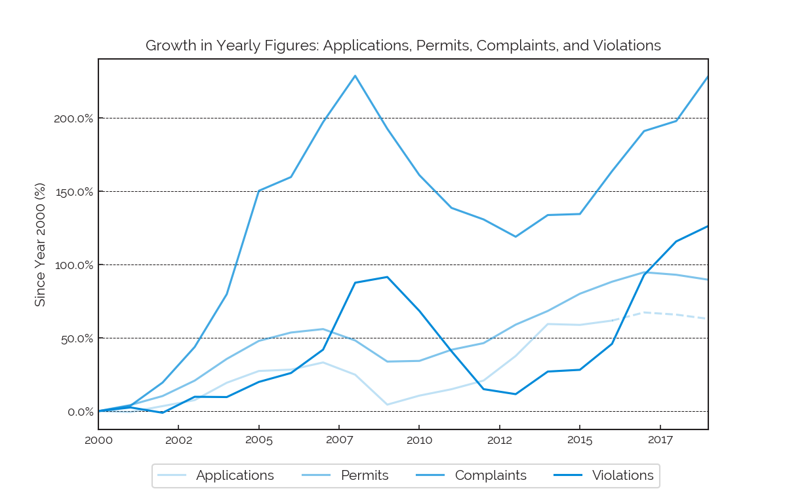

As many in real estate already know, there's a cyclical nature to construction activity. This is common in high-capEx industries such as construction and oil extraction where getting to a revenue-producing product requires heavy upfront spending. This leaves market participants sensitive to long-term signals, due to a heavy exposure and lack of agility. These signals, however, may be both imperfect and followed by many a market participant. Crowding can lead to supply gluts (price dips), pullbacks (price increases), and eventual reinvestment (in pursuit of the higher prices). We saw large increases in permit applications and issuances in the years immediately preceding the Great Recession (mid-aughts), and we saw another large run up from 2009 to around 2016 or 2017.

We also saw that, on the aggregate, complaints and violations track each other pretty well. However, we saw that these two (complaints and violations) seem to lag behind permit applications and issuances by about two years. We look to be in the midst of a plateauing, or maybe even the beginnings of a downswing, in permitting activity. It's worth mentioning that there are more permits than applications each year since a single application might cover more than one type of work at a given job, with each type potentially receiving its own permit from the DoB.

As has already been noted the DoB has implemented a new system for applications and permitting known as [DOB NOW](https://www1.nyc.gov/site/buildings/industry/dob-now.page). This is the Department of Building's self-service online tool that enables applicants to do all business with the DoB online. We included the DOB NOW permits starting from 2017 (the number of permits issued through DOB NOW in 2016 was negligible).

However, as has already been mentioned, we were limited in how we could make use of the DOB NOW applications data, due to there (at the time of this writing) not being a date column in that data set. As such, we estimated total annual applications from 2017 to 2019 based on applying the applications-to-permits ratio in 2016 to the number of permits issued in each of these subsequent years. This method was chosen for the sake of simplicity. The estimated numbers are showed with a dotted line.

#### Figure 2
- [data](#figure-2-data)
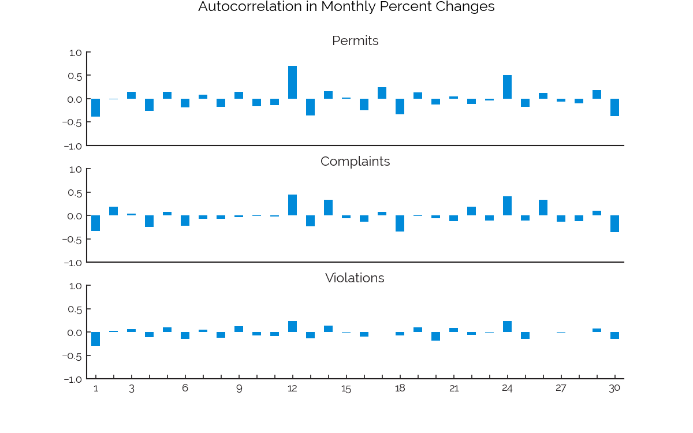

Autocorrelation represents "the correlation of a signal with a delayed copy of itself," as per [Wikipedia](https://en.wikipedia.org/wiki/Autocorrelation). Figure 2 shows the autocorrelation in monthly percent changes in permits, complaints, and violations. As with [correlation](https://en.wikipedia.org/wiki/Correlation_and_dependence), an autocorrelation of 1 indicates a perfect and positive correlation, while an autocorrelation of -1 shows a perfect and negative correlation - an autocorrelation of 0 indicates a lack of correlation. We looked at the autocorrelations of lags / shifted-values 1 through 30.

The permits data exhibited very strong autocorrelation at a lag of 12, i.e. between permits issued in the current month and in the same month in the previous year, reaching .71. We imagine that this is driven by auto-renewals. Autocorrelation in complaints also reached its highest point, 0.45, at lag 12 - this could be driven by auto-generated complaints, but we don't know. In violations, we again found the strongest autocorrelation, 0.23 at lag 12.

[^](#table-of-contents)
## Applications and Permits

#### Figure 3
- [data](#figure-3-data)
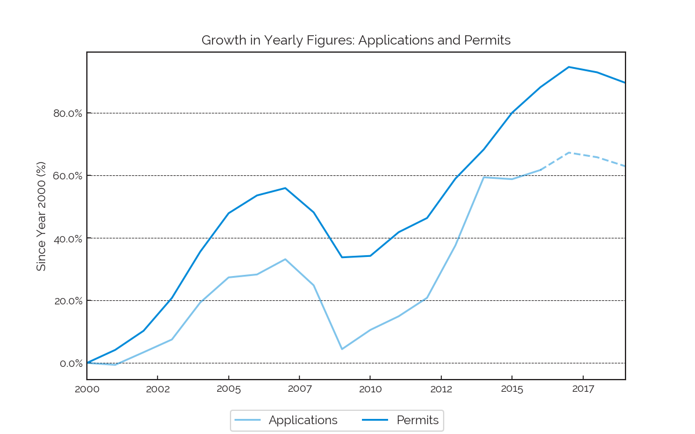

New York City issued 197,556, 195,817 and 192,399 permits each year from 2017 to 2019, including the regular / old-system DoB permits as well as those issued by DOB NOW.

To break it down by system (over the same, three-year period):

- 195,343
- 169,377
- 152,212

permits were issued through the old system, while:

- 2,213
- 26,440
- 40,187

went through DOB NOW. The DoB has been pushing its DOB NOW system as the desired standard and the system has been accounting for an increasing proportion of permit issuances each year.

Applications and permits tracked each other well over the time period study - the vast majority of applications are approved. In 2017, there are 94% more permits issued, as compared to the year 2000. The climb in permit issuance since the recession shows that the real estate market has been recovering well, but also that it may be cooling off since hitting its all-time high in 2017

#### Figure 4
- [data](#figure-4-data)
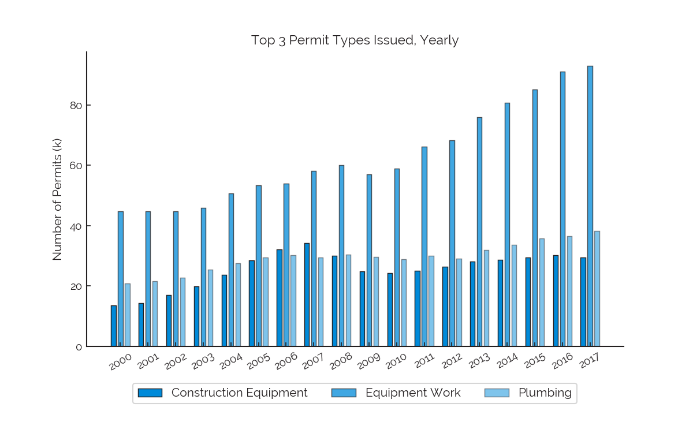

We can see here the tremendous growth in `Construction Equipment` permits issued, although it would be nice to know more about what this means - do these types of permits tie more closely to new-building construction?

It's important to note that, to thoroughly consider whether the city has _over-indexed_ on construction, one should explore applications and permits in the context of additional variables. For instance, what is the relationship between permitting rates and population density, in different parts of the city? Manhattan is geographically constrained by water on all four sides. So, outside of maybe the Hudson Yards project, where a not-so-inhabited nook of the city was developed freshly in new ways, construction will be felt much more heavily in Manhattan than, say, in deep Brooklyn.

One of the great catch-22's of modern life in NYC can be found in the interplay between cost of living and construction-related, quality-of-life issues: we want reasonable rent, but we hate the effects of the construction that helps increase housing supply to the point where prices may fall.

[^](#table-of-contents)
## Complaints and Violations

#### Figure 5
- [data](#figure-5-data)
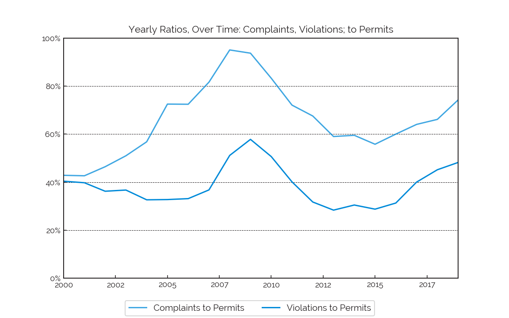

The above ratios help to put the number of annual complaints and violations in context - i.e. let's scale each measure down by permit issuance, our proxy for construction activity.

Complaints-to-permits reached 74% at the end of 2019, meaning that, for every 100 permits issued in 2019 there were 74 complaints made. To put this figure in context, this ratio sat at 43% in 2000, 95% in 2008, and 56% in 2015. One takeaway might be that real estate booms coincide with some combination of bad behavior, frustrated residents. That said, maybe the the 2008 peak had something to do with a more streamlined complaint-filing process - more work could be done to flesh this out. It's also worth highlighting the growth this measure has exhibited over the last few years - it's almost 50% higher than it was 4 years ago.

Violations-to-complaints came in at 48% last year. This measure was at 40% in 2000, 58% in 2009 (record high), and 28% in 2015. Again, opportunities for confounding abound - but the growth since 2015 is real.

#### Figure 6
- [data](#figure-6-data)
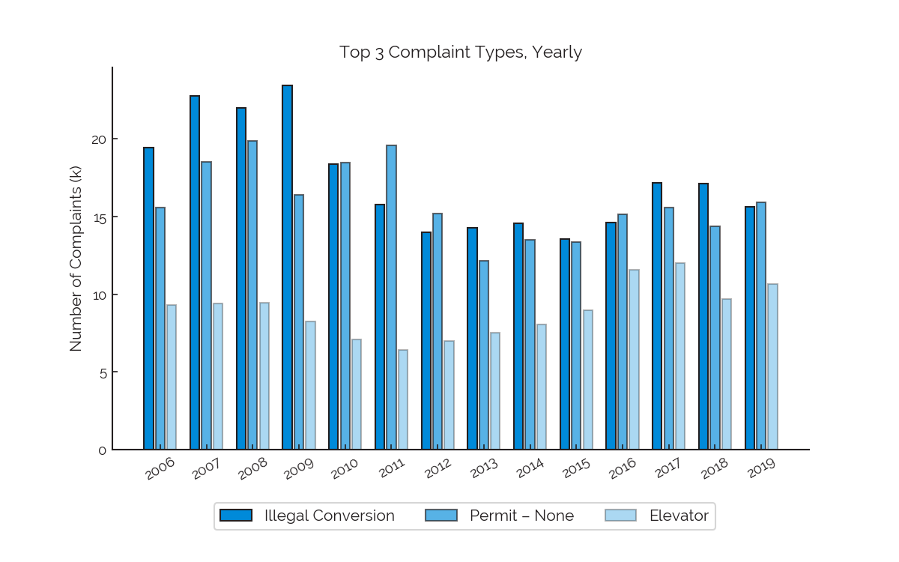

In this case, we filtered the data to 2006 - 2019 so that we could stick to plotting just 3 complaint types.

The top complaint type, `Illegal Conversion`, is [defined](https://www1.nyc.gov/site/buildings/renter/illegal-conversions-vacates.page) by the city as "an alteration or modification of an existing building to create an additional housing unit without first obtaining approval from the New York City Department of Buildings," which have declined a bit over the past few years.

Working without a permit came in first for several years in the period studied, and placed second in other years. What type of work this corresponded to, we don't know, but it makes a person wonder what kinds of maintenance and construction activities are going on outside the purview of the authorities.

The number 3, and maybe least-assuring complaint type on the list, is that of `Elevator`. What we've plotted here is actually the result of rolling two, different complaint types up to a single label. These complaint types existed at different times, with the previous elevator category, `Elevator-Danger Condition/Shaft Open/Unguarded` in recent years being substituted out in favor of two new categories, with one being more severe than the other. What you see here is the old category through 2017, and the new, more-severe category for 2018 - 2019. See the chart's corresponding data for more information.

The official, somewhat-complete complaint-type-code mappings can be seen [here](https://www1.nyc.gov/assets/buildings/pdf/complaint_category.pdf).

#### Figure 7
- [data](#figure-7-data)
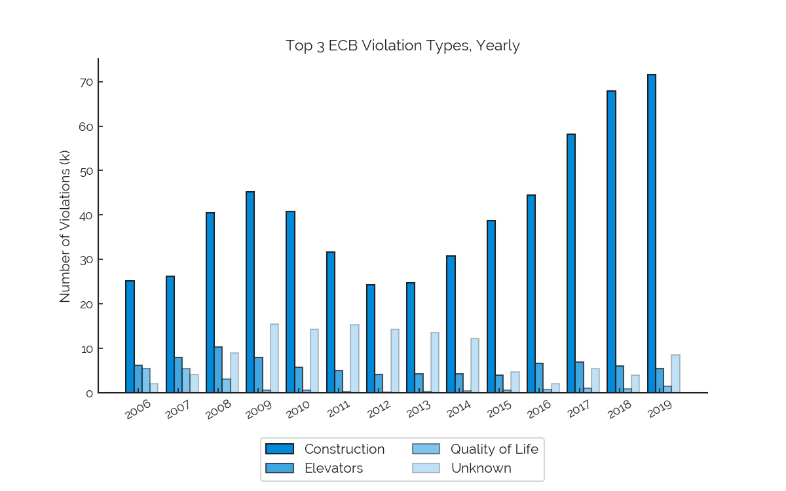

We can see here that `Construction` violations have absolutely skyrocketed since 2013, increasing from just-under 25k in that year to more than 70k in 2019. That doesn't mean there's no ambiguity - might the `Construction` category simply be absorbing some of what was previously considered `Unknown`? Could the `Unknown` category have absorbed some of what was previously tagged with `Quality of Life`? It's hard to know. Regardless, the increase in `Construction` violations is large enough to stand on its own, offering some support for the "yes, construction has been getting more harmful" argument.

[^](#table-of-contents)
## Violation Penalties

#### Figure 8
- [data](#figure-8-data)
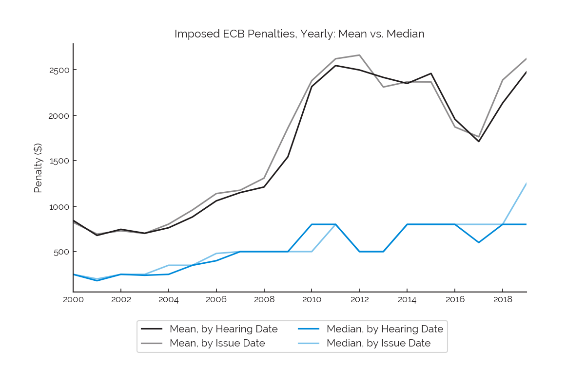

To better understand the underlying penalty data, we grouped the data by the years corresponding to two different date fields (hearing date and issue date) and calculated both the mean and median for each year. Note that _issue date_ is the date on which a violation is issued, and _hearing date_ is the date of the most recent, scheduled ECB hearing. A hearing presents an opportunity for the respondent named on a violation to either admit to or contest it.

In statistics, the mean and median are two main measures for the [central tendency](https://en.wikipedia.org/wiki/Central_tendency) of a dataset - i.e. where do the values of an at-least-somewhat random variable tend to fall? Or, more colloquially: if you had to _expect_ one value from a dataset, what would it be? Expectation refers to a data's mean, but the mean can be unduly influenced by outliers, which the median is much more robust to. Thus, the measures are related but different, and their comparison can prove valuable.

A positive (negative) difference between mean and median would indicate that the data is positively (negatively) [skewed](https://en.wikipedia.org/wiki/Skewness) - i.e. there are is a long / dispersed "tail" stretching right-ward (left-ward) away from the probabilistic center of the data. In other words, skew indicates asymmetry - when the data falls away from its center, it tends to fall farther in one direction than in the other. The large, positive difference we can see between mean in median in this chart indicates that a relatively small number of high-valued penalties are "pulling" the mean away from the center of the data. Thus, the expectation for an imposed penalty is much higher than the actual midpoint of all imposed penalties.

Surprisingly, at the end of 2018 to 2019, both the mean and median measures (in the case of the median, only by issue date) sharply increased, indicating that the city issued many expensive DoB ECB violations.

#### Figure 9
- [data](#figure-9-data)
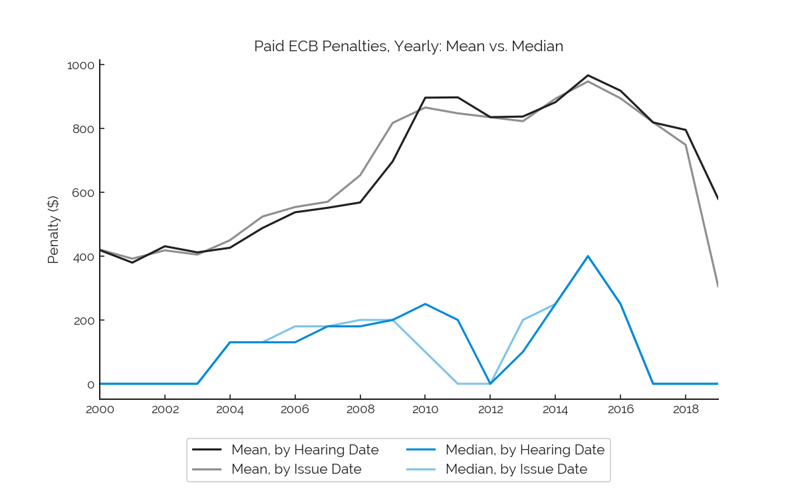

In this chart, we look at what's actually been paid by respondents, as opposed to what's been imposed by the city. Some of the trends that can be seen in the above, _imposed_ chart hold true here, too. But, the mean median measures of paid penalties have tumbled since the end of 2018, which when compared to the above data on imposed penalties indicates that many ECB penalties issued in the last two years have not been paid.

To some extent, this makes sense - there may very well be some kind of a natural gap between when penalties are paid and when they're imposed. But, when the median paid penalty spends multiple years at zero - meaning that the paid amount for at least half of all penalties imposed or heard (this trend was similar for both date fields) was _zero_ dollars - during periods of time when the median imposed penalty was more than $500, and when the mean imposed penalty was more than $1000, that seems suspect.

#### Figure 10
- [data](#figure-10-data)
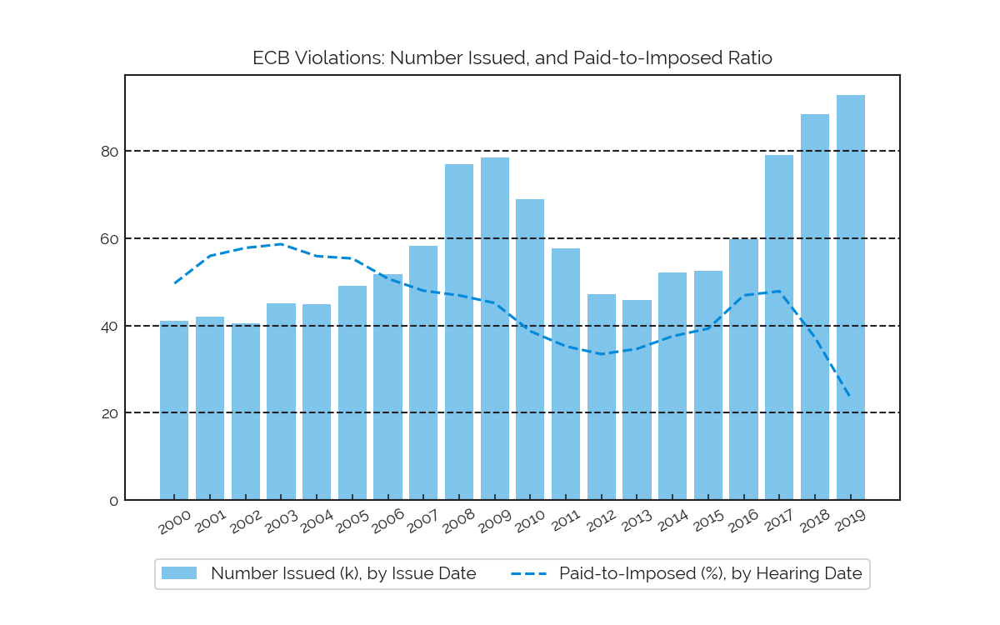

Taking the insights described under Figure 9 further, we can examine the paid-to-imposed ratio, grouped annually by hearing date. This ratio measures the total dollar value of penalties paid by respondents as a proportion of the total dollar value of penalties imposed by the ECB. The paid-to-imposed ratio went from 48% in 2017, to 37% in 2018, to 23% last year. Why the steep drop?

The blue bar shows the number of DoB-issued ECB violations issued. As we can see, after declining in the years immediately proceeding the recession, the number of violations issued has broken records each of the last 3 years, standing at over 90k for last year.

With that said, 23% does seem quite low, no?

What "good" or "bad" would mean here could surely depend on a lot of things, so let's lay it out over a couple of points. A degradation in this ratio means, unambiguously, that violations are being issued at a rate that is higher than the rate at which penalties are being paid. To gain a sense of the magnitude or severity of the problem, we can consider the rate at which the ratio is degrading to the rate at which the number of issued violations is growing. With that, paid-to-imposed fell by 22.12% between 2017 and 2018, and the number of issued violations grew by 12% over the same period - those are very different change rates! Thus it might suffice to say that the city's resources, when it comes to collecting on the penalties it's imposed, are stretched pretty thin.

#### Figure 11

- [data](#figure-11-data)
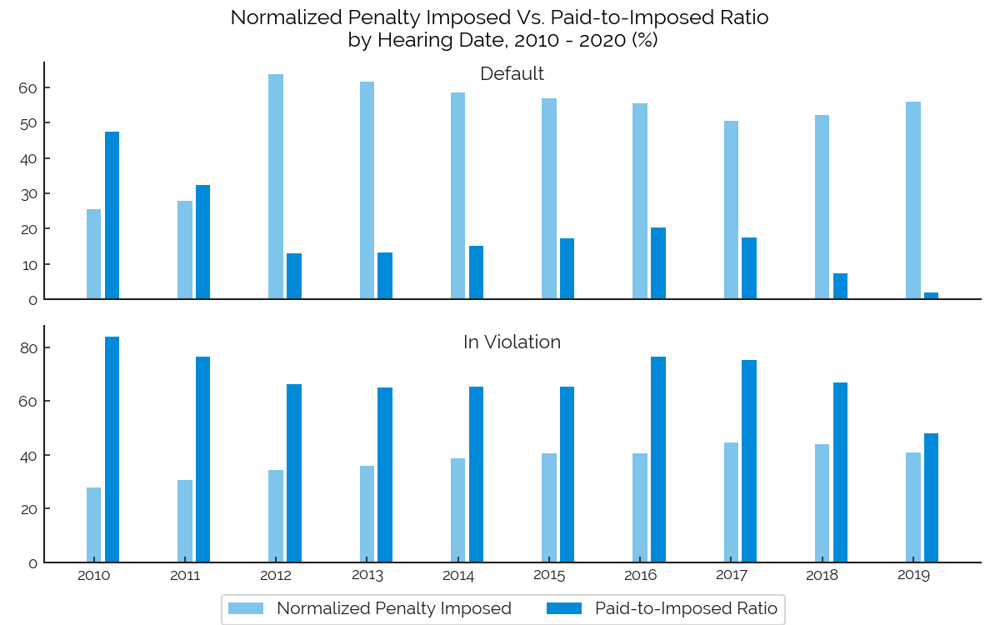

To further analyze paid-to-imposed ratios, we grouped the DoB-issued ECB violations by hearing status and hearing year. Normalized penalty imposed represents the proportion of total annual penalty imposed that each type of hearing status accounted for. We looked in detail at two hearing stati, `DEFAULT` and `IN VIOLATION`, because these stati together accounted for almost all of the total dollar value of imposed penalties last year.

*Violation Status:* `DEFAULT`

A hearing status of `DEFAULT` indicates that the respondent failed to appear for scheduled hearing and did not pay the summons prior to the hearing. ECB may add additional penalties on top the existing one(s).

We can see that violations with a status of `DEFAULT` have each year, since 2012, accounted for about 50-60% of the total dollar-value of all DoB-issued ECB violations, while the paid-to-imposed ratio over this period of time has typically stayed below 20%. Moreover, (as seen in the text accompanying [the next figure](#figure-12)) given that it usually takes less than a year for the city to hold an ECB hearing for a given violation, the 2018 paid-to-imposed ratio of 7% for `DEFAULT` violations (which accounted for 52% of the total dollar-value of DoB-issued ECB violations that year) seems outrageous - that's a lot of money that should be going to the city.

Without severe violations in place for defaulting on penalty payment, these penalties could easily come to be seen as simply a cost of doing business, payable whenever it is convenient to do so - who's to say that this isn't already the case? Stronger default penalties could make a real impact on the timeliness with which these violations are paid off.

Additionally, with such a high % of penalty dollar-value in default each year, is there any way that the city is tracking all of these down? An overburdened system presents opportunities for bad actors to slip through the cracks. With that, making an impact on payment timeliness probably means making an impact both to the city's bottom line, and to the behavior of the various players in its ecosystem.

*Violation Status:* `IN VIOLATION`

DoB-issued ECB violations with hearing status `IN VIOLATION` in the last decade typically accounted for around around 40% of the total dollar value of all DoB ECB penalties imposed each year. The paid-to-imposed ratio for these penalties peaked at 76% in 2016 and has since fallen - to 75% in 2017, 67% in 2018, and 48% last year. One reason for this decline could be the massive increase in DoB ECB Violations issued over the last few years. 

*Violation Status: All*

There are nine types of hearing status as following: 

- `IN VIOLATION`: Definition unknown.
- `CURED/IN-VIO`: Enforcement agency notes indicate that the violating conditions have been corrected prior to hearing.
- `POP/IN-VIO`: Definition unknown.
- `STIPULATION/IN-VIO`: Admission of guilt – extends compliance time by an additional 75 days from the first scheduled hearing date.
- `PENDING`: Definition unknown. Penalties of this status couldn't be found for most of the last decade, but exhibited a strangely high paid-to-imposed-ratio of 66% in 2017 and accounted for 0.15% of all DoB ECB penalties imposed that year.
- `DEFAULT`: Respondent failed to appear for scheduled hearing and did not pay the summons prior to the hearing.
- `WRITTEN OFF`: Summons has been written off and nothing is due.
- `DEFAULT`: Respondent failed to appear for scheduled hearing and did not pay the summons prior to the hearing.
- `DISMISSED`: Dismissal – No Penalty Imposed; If you prevail in contesting your violation, you will not owe any penalties and your violation will be dismissed. However, the Department may re-inspect, reissue a violation, or appeal the decision.

#### Figure 12
- [data](#figure-12-data)
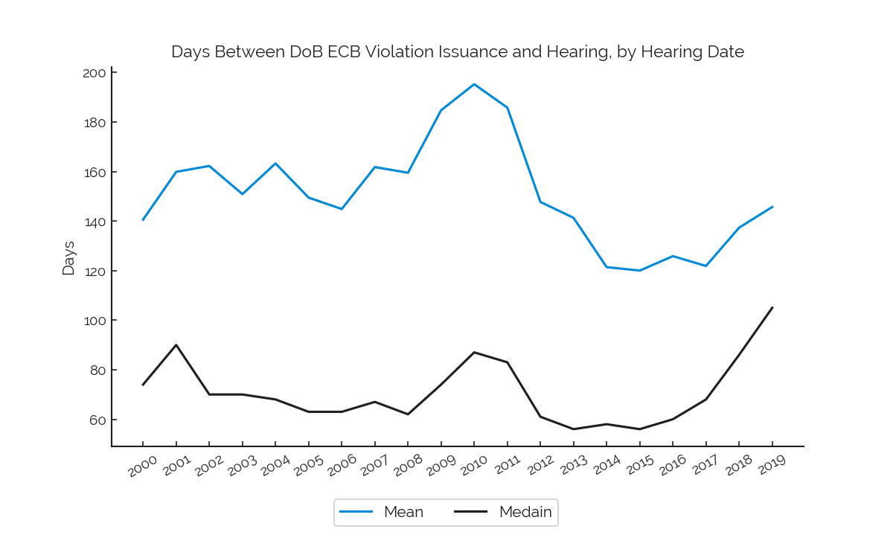

All ECB violations need to be adjudicated by the Office of Administrative Trials and Hearings (OATH), so we analyzed the day-differences between hearing and issue dates across all DoB-issued ECB violations, broken out by year.

The above chart shows us the mean and median number of days that it took for OATH/ECB to hold a hearing (i.e. the delta, in days, between hearing and issue dates) from 2000 to 2019 (by hearing date year). As we have mentioned in [figure 8](#figure-8), both mean and median measure the central tendency of a distribution, and a positive difference between the two indicates positive skewness, which we can see here. This means that there are likely extreme values that are "pulling" the mean higher.

Both the mean and median days-delta reached record-high values in 2010. For all the hearings that year, violations had been issued, on average, 195 days earlier; the median difference was 87 days. The fact that these measures were greater than they were in any previous years is likely a result of the sharp increase in ECB violations (shown in [figure 10](#figure-10)) that happened between 2007 and 2009. In other words, the city was probably overwhelmed.

The median is much more robust to outliers than the mean is, so an up-tick in the media days-delta would be a solid indicator of a slowdown in the ECB adjudication process. With that in mind, take note of the fact that between 2015 - 2019, the median days-delta value has grown by 87%. It is therefore likely reasonable to assume that the city is, once again, overwhelmed.

#### Figure 13

|Quantiles (%) | 2017 (days) |2018 (days)|2019 (days)|
|:-------:     |:-------:    |:--------:|:----------:|
|0.00	       |12	         |  1       |1
|5.00	       |45	         |  46      |49
|10.00	       |47	         |  48      |53
|25.00	       |49           |  54      |69
|50.00	       |68	         |  86      |105
|75.00	       |133          |  158     |175
|90.00	       |212          |  246     |253
|**95.00**     |**272**      |**311**   |**320**
|99.00	       |697          |  668     |634
|99.90	       |3092         |  3026    |2891
|99.99	       |6279         |	7447    |3880
|100.00        |10347        |  9639    |6506

We further analyze the days-delta values described [above](#figure-12) through looking at some different [percentiles](https://en.wikipedia.org/wiki/Percentile) for this measure, in 2017, 2018, and 2019 (by hearing date year). The value for a given percentile represents the value below which a given percent of the data lies. For instance, the median (it would be reasonable to say) is the 50th percentile.

We highlight the 95th percentile to substantiate the claim that most violations have been heard within a year. In 2017, 95% of DoB-issued ECB violations that had a hearing that year had done so within 272 days of issuance. For 2018, this number was 311 days. A penalty, if imposed, is imposed at hearing and is (as far as we know) due pretty much immediately, unless some other agreement has been made.

Thus, a full year (or 365 days) seems a good window over which to judge penalty collection, which adds strength to our paid-penalty analyses accompanying Figures 9 and 10.

Finally, it is worth mentioning that we have about 30 years of DoB ECB violation data, so it is not inconceivable that, over this entire time period, a small number of violations managed to ride out the pre-hearing period for a very long time. These extreme values may also represent data errors. We're not sure.

#### Figure 14
- [data](#figure-14-data)
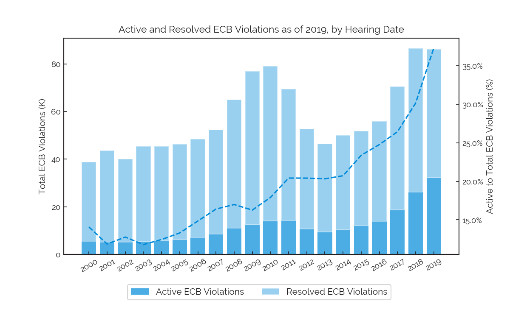

Active ECB violations are violations that still need to be addressed, whereas resolved ECB violations have either been cured, paid, or dismissed. The above graph shows the breakdown of ECB violations, by status, which have been heard as of 2019 (we are grouping by hearing date).The dash line represents total amount of active ECB violations to total ECB Violations (active-to-total).

Active-to-total has held at at least 20% since 2001, and hit 30% in 2018, highlighting that the city has been kept busy with all the recently issued violations.

#### Figure 15
- [data](#figure-15-data)
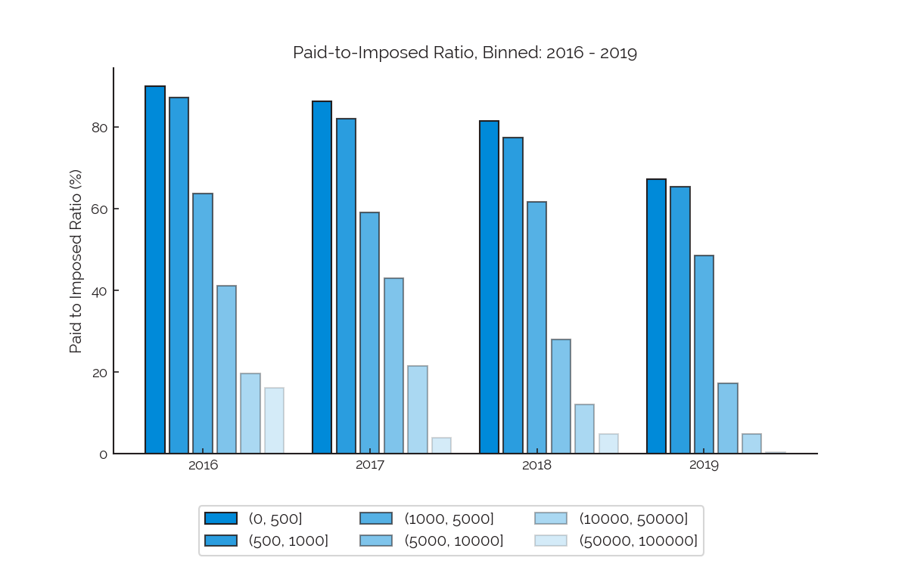

We were interested in assessing whether, as it did when broken out by violation status, paid-to-imposed showed some variability across penalty size (in dollars). So, we calculated the paid-to-imposed ratio across 6 different imposed-penalty bins. These were (in dollars):

- 0-500
- 500-1,000
- 1,000-5,000
- 5,000-10,000
- 10,000-50,000
- 50,000-100,000

and we looked at this data over the past 4 years. From 2016 to 2019, paid-to-imposed ratios decreased as the imposed-penalty bin boundaries went higher. Paid-to-imposed ratios - even in 2018 - were close to 80% for the two lowest bins. However, these ratios plummeted in the higher bins, falling to 20% and below - even in 2019 - for the two highest bins.

It would appear that the city has trouble collecting on its steeper penalties.

#### Figure 16
 
|ECB Violation Type	 |Year   |Normalized Violation Counts|Normalized Imposed Penalty|Paid to Imposed
|:------------------:|:-------------: |:------------------: |:----------------:  |:-----------:
|Boilers             |2017            |0.04                 |    0.02            |0.43
|                    |2018            |0.03                 |    0.01            |0.43
|                    |2019            |0.02                 |    0.01            |0.34
|**Construction**    |**2017**        |**0.74**             |    **0.78**        |**0.45**
|                    |**2018**        |**0.77**             |    **0.80**        |**0.34**
|                    |**2019**        |**0.77**             |    **0.76**        |**0.22**
|Cranes and Derricks |2017            |0.00                 |    0.01            |0.83
|                    |2018            |0.01                 |    0.01            |0.81
|                    |2019            |0.00                 |    0.01            |0.41
|Elevators	         |2017            |0.09                 |    0.04            |0.72
|                    |2018            |0.07                 |    0.03            |0.49
|                    |2019            |0.06                 |    0.03            |0.43
|Local Law	         |2017            |0.00                 |    0.01            |0.66
|                    |2018            |0.04                 |    0.01            |0.49
|                    |2019            |0.00                 |    0.01            |0.51
|Plumbing	         |2017            |0.03                 |    0.02            |0.58
|                    |2018            |0.01                 |    0.01            |0.46
|                    |2019            |0.01                 |    0.01            |0.30
|Public Assembly	 |2017            |0.00                 |    0.00            |0.80
|                    |2018            |0.00                 |    0.00            |1.04
|                    |2019            |0.00                 |    0.00            |0.06
|**Quality of Life** |**2017**        |**0.01**             |    **0.03**        |**0.43**
|                    |**2018**        |**0.01**             |    **0.04**        |**0.30**
|                    |**2019**        |**0.02**             |    **0.09**        |**0.07**
|Signs	             |2017            |0.01                 |    0.01            |0.39
|                    |2018            |0.01                 |    0.02            |0.36
|                    |2019            |0.01                 |    0.01            |0.27
|Site Safety	     |2017            |0.00                 |    0.00            |1.12
|                    |2018            |0.00                 |    0.00            |0.47
|                    |2019            |0.01                 |    0.01            |0.20
|Unknown	         |2017            |0.07                 |    0.08            |0.60
|                    |2018            |0.04                 |    0.09            |0.60
|                    |2019            |0.09                 |    0.12            |0.39
|Zoning	             |2017            |0.01                 |    0.00            |0.66
|                    |2018            |0.02                 |    0.01            |0.67
|                    |2019            |0.01                 |    0.00            |0.57

This table shows the percentages of DoB ECB violations:

- issued (in counts, as grouped by issuance year) 
- imposed (in dollars, as grouped by hearing year)

as well as the paid-to-imposed ratios, also as grouped by hearing year. All data displayed is broken out by year and by violation type, for 2017 - 2019.

We can see that `Construction` violations account for the lion's share of both the number of issued penalties and the total dollar-value of imposed penalties. Additionally, we can see that `Construction` violations show a poor paid-to-imposed ratio. This relative lack of payment, paired with outsized contributions to `Normalized Imposed Penalty`, has led to a large percentage of the violation dollars imposed in recent years not being paid.

More quantitatively, with a paid-to-imposed ratio of just 34% in 2018 but an 80% contribution to all penalty dollars imposed, `Construction` penalties in 2018 single-handedly account for the current (as of our analysis) *non-payment of 73% of all violation dollars imposed that year*.

`Quality of Life` violations, with regard to paid-to-imposed ratio, tumbled even more drastically - only 7% of those that were issued last year have been paid. These account for only a small percent of the total dollar-value of imposed penalties, although that contribution grew noticeably between 2018 and 2019.

The large increase in the issuance of `Construction` violations (as show in [figure 7](#figure-7)), as construction activity overall has increased, supports the idea that some landlords and developers treat violation receipt as simply a cost of doing business. When breaking the data out by violation type, we see (in certain categories) declines in penalty payment severe enough to suggest that some landlords and developers may even look at these violations as something along the lines of a _pay-as-you-wish_ cost of doing business.

It's certainly possible that some of the particularly egregious, still-outstanding balances will be remedied in the near future. However, the observable declines in penalty payment could indicate a real and negative change in the city's collection capabilities. Such a change could be driven by some combination of a number of factors, including (for example):

- an over-burdened ECB
- overly cheap penalties
- developer and / or landlord malfeasance
- developer and / or landlord financial strife

It is our hope that this analysis will be taken further (whether by some other party, by NewTrails, or both) so that the residents of New York City can continue to gain insight into the underlying causes of the deteriorating quality of life that so many of us have experienced in recent years.

#### Figure 17
- [data](#figure-17-data)
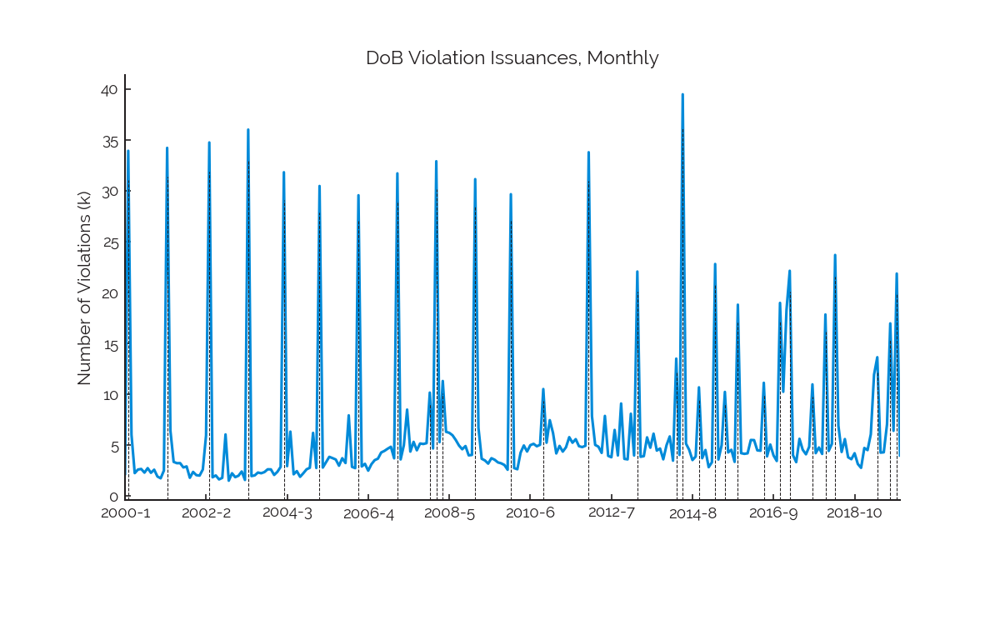

We grouped (non-ECB) DoB violations by issued year and month from 2000 to 2019 to allow us to understand the trend in the issuance of these violations over the years.

As has already been mentioned, the periodic spikes probably coincide with auto-generated violations that are issued from time to time. That doesn't mean that this chart didn't look surprising to us! Something like yearly autocorrelation (as we saw [above](#figure-2)) was to be expected - but clusters around the same calendar month each year, that was surprising.

We were unable to come to a conclusion on whether a default on a DoB-issued ECB violation yields a DoB violation - this is an important question that we're hoping someone can answer for us. If that is the case, the jagged temporality of this data could be aggravating efforts to enforce payment on DoB-issued ECB violations, as perpetrators might be either confused about the consequences for penalty default, or aware of the fact that further penalties may be more tied to the calendar month than the date of default.

This last clause, that "further penalties may be more tied to the calendar month than the date of default," would (if true) indicate some room for improvement in this default-penalization process. 

#### Figure 18
- [data](#figure-18-data)
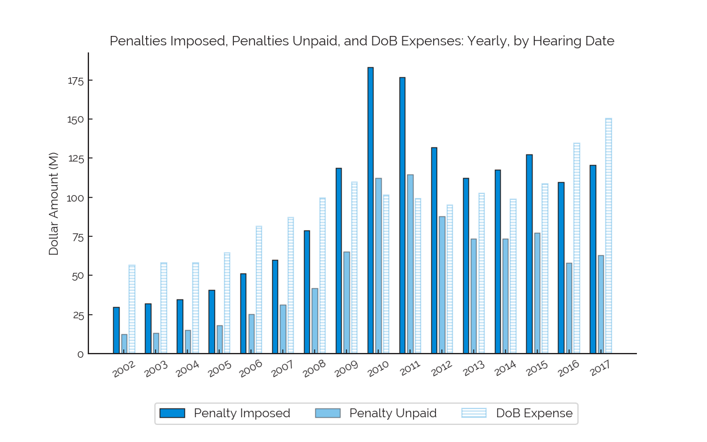

We wanted to put some of the normalized values we've been discussing into a dollar-value context, and so we plotted, in dollars and by hearing date year:
- total imposed DoB ECB penalties
- total unpaid DoB ECB penalties
- [total annual expenses](https://data.cityofnewyork.us/City-Government/Expense-Actuals/7yay-m4ae) for the DoB

The DoB's expense data was only available for 2002 - 2017 in the dataset that we chose to use, and so we restricted our plot to this time range.

It is surprising to see that penalties imposed exceeded the total expense of the DoB from 2009 to 2015. For 2010 and 2011, penalties unpaid also exceeded the DoB's annual expenses.

The DoB's expenses have increased since 2014, during which time penalties imposed (in dollars) have oscillated, and were up only a small bit as of 2017, our most recent year. Unpaid penalties for 2017 are down from where they were a couple of years prior, but still tie out, proportionately, to 42% of the DoB's total annual expenses.

The DoB could potentially get much more funding for itself, and therefore many more resources with which it could squash problematic activity, if it was better able to collect on outstanding payments.

[^](#table-of-contents)
## Recommendations

Successfully executing on penalty collection is critical to the New York City government's protection of its residents' quality of life. As we have already discussed, a failure to execute can lead to more corner cutting, unsafe conditions - more in-violation activity.

Rigorous enforcement of DoB-issued ECB penalty collection would likely reduce the number of violations in default, thus:

- reducing the outstanding balance owed to the city
- increasing the likelihood of penalty payment
- discouraging bad behavior that may be driven by the opportunity for low-cost penalty default

Additionally, the maintenance of a reasonable gap between issuance and hearing dates for DoB-issued ECB penalties would reduce the ability of harmful actors to delay, e.g. until units in a new building are sold, penalty payment in such a way that is helpful to their cash flows.

The achievement of these goals may require additional human resources, since it seems that the increases in penalty-collection laxness are strongly related to increases in penalty-issuance volumes. That said, automated and possibly statistical tools could allow for a more efficient and manageable path to execution.

Finally, the city needs to ensure that violation penalties do not remain stagnant. New York City, even in its ups and downs, remains a competitive real state market. If the profits arising from real estate construction and management outpace the costs associated with violating the building code, then it is simply good business to violate the code. The penalties for violating the building code should be steep enough to dissuade real estate participants from engaging in such violations.

[^](#table-of-contents)
## Next Steps

We can reiterate, once again, that we have painted in broad strokes. Construction activity varies from neighborhood to neighborhood, and further analysis at the borough and neighborhood levels would be very interesting to see. It would also be helpful to see measures of population density compared to construction activity, as the various "effects" of construction activity are surely felt differently, depending on how dense the surrounding area is. 

Additionally, analysis on the relationships between economic factors (e.g. [REIT valuations](https://www.reit.com/what-reit?gclid=Cj0KCQiAqNPyBRCjARIsAKA-WFzmxqJWaTebuH8MXvH0l2T5_Qkix2Fus-tDbNk8rRArIU8SujMA8x4aAj7TEALw_wcB), [residential rental prices](https://streeteasy.com/blog/data-dashboard/?agg=Median&metric=Asking%20Rent&type=Rentals&bedrooms=Any%20Bedrooms&property=Any%20Property%20Type&minDate=2010-01-01&maxDate=2020-01-01&area=Flatiron,Brooklyn%20Heights), [residential sales prices](https://streeteasy.com/blog/data-dashboard/?agg=Median&metric=Asking%20Price&type=Sales&bedrooms=Any%20Bedrooms&property=Any%20Property%20Type&minDate=2010-01-01&maxDate=2020-01-01&area=Flatiron,Brooklyn%20Heights)) and the data we've analyzed here would be interesting to see. For instance, a capEx-heavy industry such as real estate will surely exhibit cyclical tendencies - we did in fact see this in the DoB data[\*](#figure-2). Comparing these tendencies to pricing trends, an understanding of which could benefit developers's sense of market timing, was something that we'd hoped to do, but didn't have time for. And, regarding ECB violations - it would be interesting to flesh out whether there is, or whether there should be, any relationship between the real estate market's economic health and the city's penalty imposition or collection.

Finally, our initial and ambitious hope for this project was to understand if there were certain, key developers or landlords who were regularly flouting the building code and who had thus far managed to escape real punishment and / or exclusion from the NYC real estate landscape. A lack of punishment for persistent rule flouting essentially green-lights violating the building code in the name of cost cutting or project expediency. Taken further, a lack of enforcement effectively implements rule flouting as a de facto _requirement_ for any developer or landlord who wishes to seriously compete in the marketplace.

As such, we had envisioned trying to link violations to their perpetrating landlords or developers, and to the permit applications that ultimately led to the problematic behavior. Setting aside the various obfuscations practiced by many landlords and developers (including the use of LLCs and / or shell companies) and considering only the data that we had access to, the permit application and issuance datasets did not directly (i.e. at the level of a record) link to either complaints or violations. Even complaints and violations did not directly link to each other. Executing on a "record linkage" project is well within the scope of our abilities but was not something that we were able to invest the time into completing. That said, we had been of the mind that such a linkage could have enabled us to answer questions like:

- what types of projects are most prone to in-violation activities?
- which permit applicants can be traced to the most violations?
- how do the answers to each of the above questions change over time?

Answers to such questions would better arm the city to weed out problematic actors from its buildings ecosystem.

[^](#table-of-contents)
## Appendix

#### Figure 1 Data
- *Growth in Yearly Figures: Applications, Permits, Complaints, and Violations*
- \* in below table indicates estimated value, due to the data issues explained [here](#application-filings)
- total annual applications from 2017 to 2019 were estimated based on the applications-to-permits ratio in 2016
- [back to figure](#figure-1)

| Year | Applications          | Permits | Complaints | Violations (ECB) |
| :--: | -----------:          | ------: | ---------: | ---------------: |
| 2000 |    67,735             | 101,496 |   43,520   |      41,030      |
| 2001 |    67,320             | 105,728 |   45,124   |      42,059      |
| 2002 |    70,045             | 111,931 |   51,991   |      40,566      |
| 2003 |    72,817             | 122,595 |   62,542   |      45,041      |
| 2004 |    80,833             | 137,618 |   78,212   |      44,962      |
| 2005 |    86,264             | 150,087 |  108,873   |      49,196      |
| 2006 |    86,896             | 155,861 |  112,953   |      51,687      |
| 2007 |    90,201             | 158,250 |  129,247   |      58,225      |
| 2008 |    84,548             | 150,370 |  142,991   |      76,940      |
| 2009 |    70,726             | 135,770 |  127,278   |      78,540      |
| 2010 |    74,889             | 136,243 |  113,516   |      69,054      |
| 2011 |    77,847             | 143,943 |  103,800   |      57,781      |
| 2012 |    81,843             | 148,534 |  100,377   |      47,173      |
| 2013 |    93,195             | 161,322 |   95,242   |      45,773      |
| 2014 |   107,943             | 170,787 |  101,680   |      52,095      |
| 2015 |   107,544             | 182,714 |  101,984   |      52,582      |
| 2016 |   109,527             | 191,006 |  114,679   |      59,838      |
| 2017 |   113,287* | 197,556 |  126,587   |      79,105      |
| 2018 |   112,290* | 195,817 |  129,562   |      88,482      |
| 2019 |   110,330* | 192,399 |  142,873   |      92,800      |

--

#### Figure 2 Data
- *Autocorrelation in Monthly Percent Changes*
- [back to figure](#figure-2)

| Lags| Permits | Complaints   | Violations (ECB) |
| :--:| ------: | ---------:   | ---------------: |
| 1   | -0.382373 | -0.328890  |  -0.291068       |
| 2   | -0.008993 |  0.192306  |   0.025308       |
| 3   |  0.146137 |  0.039626  |   0.068256       |
| 4   | -0.259690 | -0.244665  |  -0.107328       |
| 5   |  0.148509 |  0.080146  |   0.099334       |
| 6   | -0.182140 | -0.225224  |  -0.139810       |
| 7   |  0.089662 | -0.070911  |   0.056295       |
| 8   | -0.176381 | -0.075883  |  -0.116743       |
| 9   |  0.147122 | -0.034335  |   0.122574       |
| 10  | -0.159407 | -0.006957  |  -0.069506       |
| 11  | -0.143229 | -0.026291  |  -0.085073       |
| 12  |  0.707353 |  0.449963  |   0.236153       |
| 13  | -0.362506 | -0.235264  |  -0.130263       |
| 14  |  0.162864 |  0.336698  |   0.134334       |
| 15  |  0.026297 | -0.056239  |  -0.007688       |
| 16  | -0.247162 | -0.130894  |  -0.096528       |
| 17  |  0.242613 |  0.078137  |   0.010223       |
| 18  | -0.336469 | -0.339339  |  -0.064154       |
| 19  |  0.134917 | -0.011767  |   0.108028       |
| 20  | -0.121456 | -0.054585  |  -0.180632       |
| 21  |  0.049985 | -0.116279  |   0.093528       |
| 22  | -0.115574 |  0.184815  |  -0.054410       |
| 23  | -0.040642 | -0.113334  |  -0.011686       |
| 24  |  0.499464 |  0.403487  |   0.236234       |
| 25  | -0.177592 | -0.105215  |  -0.137769       |
| 26  |  0.118807 |  0.337581  |   0.008371       |
| 27  | -0.060310 | -0.130789  |  -0.012436       |
| 28  | -0.106392 | -0.116708  |   0.004337       |
| 29  |  0.187828 |  0.098104  |   0.079013       |
| 30  | -0.370341 | -0.357268  |  -0.146401       |

--

#### Figure 3 Data
- *Growth in Yearly Figures: Applications and Permits*
- [back to figure](#figure-3)

|Year|applications |permits
|:--:|:-------:    |:---------:
|2000|0.00000      | 0.000000
|2001|-0.61268     | 4.169622
|2002|3.410349     | 10.28119
|2003|7.502768     | 20.78801
|2004|19.337123    | 35.58958
|2005|27.355134    | 47.87479
|2006|28.288182    | 53.56368
|2007|33.167491    | 55.91747
|2008|24.821732    | 48.15362
|2009|4.415738     | 33.76881
|2010|10.561748    | 34.23484
|2011|14.928767    | 41.82135
|2012|20.828228    | 46.34468
|2013|37.587658    | 58.94419
|2014|59.360744    | 68.26968
|2015|58.771684    | 80.02088
|2016|61.699269    | 88.19066
|2017|67.251284    | 94.64412
|2018|65.779044    | 92.93075
|2019|62.885358    | 89.56313

--

#### Figure 4 Data
- *Top 3 Permit Types Issued, Yearly*
- [back to figure](#figure-4)

| Year  | Construction Equipment | Equipment Work |  Plumbing|
| :--:  | -----:                 | -----:         | ---:     |          
|2000   |13.569                  |          44.797|  20.807
|2001   |14.418                  |          44.733|  21.625
|2002   |16.969                  |          44.827|  22.798
|2003   |19.812                  |          45.836|  25.495
|2004   |23.701                  |          50.635|  27.585
|2005   |28.524                  |          53.444|  29.536
|2006   |32.166                  |          53.891|  30.14
|2007   |34.315                  |          58.221|  29.496
|2008   |29.978                  |          60.043|  30.445
|2009   |24.86                   |          57.115|  29.677
|2010   |24.361                  |          59.017|  28.937
|2011   |25.051                  |          66.12 |  30.004
|2012   |26.38                   |          68.324|  29.076
|2013   |28.199                  |          75.961|  31.998
|2014   |28.746                  |          80.712|  33.718
|2015   |29.4                    |          85.193|  35.743
|2016   |30.295                  |          91.03 |  36.585
|2017   |29.511                  |          92.948|  38.22

--

#### Figure 5 Data
- *Yearly Ratios, Over Time: Complaints, Violations; to Permits*
- [back to figure](#figure-5)

| Year | Complaints to Permits | Violations (ECB) to Permits |
| :--: | --------------------: | --------------------------: |
| 2000 |       0.428785        |       0.404252              |
| 2001 |       0.426793        |       0.397804              |
| 2002 |       0.464492        |       0.362420              |
| 2003 |       0.510151        |       0.367397              |
| 2004 |       0.568327        |       0.326716              |
| 2005 |       0.725399        |       0.327783              |
| 2006 |       0.724703        |       0.331622              |
| 2007 |       0.816727        |       0.367930              |
| 2008 |       0.950928        |       0.511671              |
| 2009 |       0.937453        |       0.578478              |
| 2010 |       0.833188        |       0.506844              |
| 2011 |       0.721119        |       0.401416              |
| 2012 |       0.675785        |       0.317591              |
| 2013 |       0.590384        |       0.283737              |
| 2014 |       0.595361        |       0.305029              |
| 2015 |       0.558162        |       0.287783              |
| 2016 |       0.600395        |       0.313278              |
| 2017 |       0.640765        |       0.400418              |
| 2018 |       0.661648        |       0.451861              |
| 2019 |       0.742623        |       0.482331              |

--

#### Figure 6 Data
- *Top 3 Complaint Types, Yearly*
- [back to figure](#figure-6)

| Year | Illegal Conversion | Permit – None | Elevator (Old Category) | Elevator (New Category)    |
| :--: | -----------------: | ------------: | ----------------------: | -------------------------: |
| 2006 |   19.424           |     15.571    |     9.281               |   NaN                      |
| 2007 |   22.739           |     18.483    |     9.413               |   NaN                      |
| 2008 |   21.966           |     19.855    |     9.431               |   NaN                      |
| 2009 |   23.409           |     16.396    |     8.250               |   NaN                      |
| 2010 |   18.370           |     18.454    |     7.082               |   NaN                      |
| 2011 |   15.745           |     19.580    |     6.433               |   NaN                      |
| 2012 |   13.977           |     15.190    |     7.002               |   NaN                      |
| 2013 |   14.273           |     12.143    |     7.520               |   NaN                      |
| 2014 |   14.568           |     13.508    |     8.034               |   NaN                      |
| 2015 |   13.527           |     13.366    |     8.952               |   NaN                      |
| 2016 |   14.622           |     15.110    |     11.572              |   NaN                      |
| 2017 |   17.179           |     15.566    |     11.992              |   NaN                      |
| 2018 |   17.107           |     14.370    |     NaN                 |   9.674                    |
| 2019 |   15.603           |     15.916    |     NaN                 |   10.643                   |

--

#### Figure 7 Data
- *Top 3 ECB Violation Types, Yearly*
- [back to figure](#figure-7)

| Year | Construction | Elevators | Quality of Life | Unknown   |
| :--: | ---------:   | --------: | -------------:  | --------: |
| 2006 |   25.230     |  6.217    |     5.475       |   2.040   |
| 2007 |   26.208     |  7.923    |     5.385       |   4.113   |
| 2008 |   40.431     |  10.373   |     3.161       |   9.052   |
| 2009 |   45.217     |  7.888    |     0.627       |   15.514  |
| 2010 |   40.791     |  5.757    |     0.604       |   14.334  |
| 2011 |   31.625     |  4.972    |     0.363       |   15.344  |
| 2012 |   24.287     |  4.065    |     0.163       |   14.305  |
| 2013 |   24.700     |  4.276    |     0.252       |   13.566  |
| 2014 |   30.764     |  4.216    |     0.429       |   12.234  |
| 2015 |   38.801     |  3.957    |     0.633       |   4.648   |
| 2016 |   44.424     |  6.653    |     0.807       |   2.095   |
| 2017 |   58.225     |  6.925    |     1.058       |   5.405   |
| 2018 |   67.900     |  6.088    |     0.922       |   3.980   |
| 2019 |   71.532     |  5.439    |     1.491       |   8.614   |

--

#### Figure 8 Data
- *Imposed ECB Penalties, Yearly: Mean vs. Median*
- [back to figure](#figure-8)

|Issue Year| Mean       |Median|Hearing Year | Mean             |Median|
|:-------: |:----------:|:---: |:----------: |:----------------:|:---: |
|2000      | 822.829466 |250.0 |    2000     |843.5884788478850	| 250.0
|2001      | 692.964526 |200.0 |    2001     |678.3566753627170	| 180.0
|2002      | 729.038357 |250.0 |    2002     |745.3990105936440	| 250.0
|2003      | 700.333407 |250.0 |    2003     |701.9465517621390	| 240.0
|2004      | 802.410591 |350.0 |    2004     |762.2334090558210	| 250.0
|2005      | 957.911172 |350.0 |    2005     |881.2444449247800	| 350.0
|2006      | 1138.404550|480.0 |    2006     |1058.6154163742200| 400.0
|2007      | 1175.498205|500.0 |    2007     |1149.1942861513700| 500.0
|2008      | 1308.193930|500.0 |    2008     |1210.7764213892600| 500.0
|2009      | 1859.663222|500.0 |    2009     |1542.9416647181100| 500.0
|2010      | 2380.383830|500.0 |    2010     |2315.5780727143900| 800.0
|2011      | 2620.992368|800.0 |    2011     |2546.2986676269400| 800.0
|2012      | 2661.495654|500.0 |    2012     |2497.6836732759600| 500.0
|2013      | 2310.251285|500.0 |    2013     |2416.036066691030	| 500.0
|2014      | 2367.043118|800.0 |    2014     |2349.4754807673100| 800.0
|2015      | 2366.361085|800.0 |    2015     |2459.605247914740	| 800.0
|2016      | 1871.004867|800.0 |    2016     |1956.63924582552	| 800.0
|2017      | 1762.884373|800.0 |    2017     |1710.841972509570	| 600.0
|2018      | 2387.357734|800.0 |    2018     |2134.2540692700700| 800.0
|2019      | 2622.369828|1250.0|    2019     |2476.1035762572300| 800.0

#### Figure 9 Data
- *Paid ECB Penalties, Yearly: Mean vs. Median*
- [back to figure](#figure-9)

|Issue Year| Mean               |Median|Hearing Year | Mean             |Median|
|:-------: |:------------------:|:---: |:----------: |:----------------:|:---: |
|2000      | 420.31777187424    |0.0   |    2000     |418.9148069949860	| 0.0
|2001      | 392.00367364892200 |0.0   |    2001     |379.6388663096720	| 0.0
|2002      | 418.0449115022440  |0.0   |    2002     |430.89797971217300| 0.0
|2003      | 404.7831588996700  |0.0   |    2003     |411.7189105375680	| 0.0
|2004      | 449.83422356656800 |130.0 |    2004     |426.1413630047870	| 130.0
|2005      | 524.0713415724850  |130.0 |    2005     |488.05953224969800| 130.0
|2006      | 553.7166212006900  |180.0 |    2006     |537.31712831840200| 130.0
|2007      | 570.222657277802   |180.0 |    2007     |551.35253317780200| 180.0
|2008      | 653.3622019755650  |200.05|    2008     |568.10924556440300| 180.0
|2009      | 817.5204583651650  |200.0 |    2009     |696.82715263704900| 200.0
|2010      | 865.5988876821020  |100.0 |    2010     |896.39615858518100| 250.0
|2011      | 847.4791803534040  |0.0   |    2011     |897.44453510983300| 200.0
|2012      | 835.1980980645720  |0.0   |    2012     |835.44033324487500| 0.0
|2013      | 822.7347117296220  |200.0 |    2013     |837.3819082837040	| 100.0
|2014      | 893.4595888281020  |250.0 |    2014     |882.41543356069800| 250.0
|2015      | 947.3545804647990  |400.0 |    2015     |966.5381605267200	| 400.0
|2016      | 894.4359687823770  |250.0 |    2016     |918.3032983302060 | 250.0
|2017      | 819.444093040896   |0.0   |    2017     |818.7907139010900	| 0.0
|2018      | 748.740919622064   |0.0   |    2018     |795.53807542021900| 0.0
|2019      | 305.1469738146550  |0.00  |    2019     |579.71646015236200| 0.0

#### Figure 10 Data
- *ECB Penalties Yearly: Number Issued, by Issue Date; Paid-to-Imposed Ratio, by Hearing Date*
- [back to figure](#figure-10)

|Year| Ratio (%)|  Violations (K)|
|:--:|:--------:|  :------------:|
|2000| 49.658668|	41.030       |    
|2001| 55.964491|	42.059       |    
|2002| 57.807694|	40.566       |   
|2003| 58.653883|	45.041       |   
|2004| 55.906938|	44.962       |    
|2005| 55.382991|	49.196       |
|2006| 50.756593|	51.687       |
|2007| 47.977312|	58.225       |
|2008| 46.921069|	76.940       |
|2009| 45.162248|	78.540       |
|2010| 38.711549|	69.054       |
|2011| 35.245061|	57.781       |
|2012| 33.448604|	47.173       |
|2013| 34.659329|	45.773       |
|2014| 37.557975|	52.095       |
|2015| 39.296474|	52.582       |
|2016| 46.932683|	59.838       |
|2017| 47.858933|	79.105       |
|2018| 37.274759|	88.482       |
|2019| 23.412447|	92.800       |

#### Figure 11 Data
- *Normalized Penalty Imposed Vs. Paid-to-Imposed Ratio, by Hearing Date, 2010 - 2020*
- [back to figure](#figure-11)

- Normalized Penalty Imposed  	

|Year |DEFAULT | IN VIOLATION |PENDING
|:---:|:------:|:------------:|:-----:
|2010 | 0.2551 |  0.2801      |0.0000 
|2011 | 0.2781 |  0.3061      |0.0000 
|2012 | 0.6381 |  0.3448      |NaN    
|2013 | 0.6153 |  0.3599      |0.0000 
|2014 | 0.5849 |  0.3880      |NaN    
|2015 | 0.5691 |  0.4068      |NaN    
|2016 | 0.5547 |  0.4058      |NaN    
|2017 | 0.5055 |  0.4449      |0.0015 
|2018 | 0.5220 |  0.4393      |0.0000 
|2019 | 0.5598 |  0.4103      |0.0002 

- Paid to Imposed Ratio

|Year |DEFAULT| IN VIOLATION| PENDING
|:---:|:-------:|:---------:|:--------:
|2010 |0.473319 | 0.838798  |0.000000
|2011 |0.322927 | 0.765718  |NaN
|2012 |0.129904 | 0.661808  |NaN
|2013 |0.132598 | 0.651158  |NaN
|2014 |0.151629 | 0.654419  |NaN
|2015 |0.173058 | 0.652355  |NaN
|2016 |0.203692 | 0.764692  |NaN
|2017 |0.174569 | 0.753715  |0.663402
|2018 |0.072933 | 0.668929  |NaN
|2019 |0.019203 | 0.480588  |0.022704

#### Figure 12 Data
- *Average Days for ECB to Hear a Violation: 2000 - 2019*
- [back to figure](#figure-12)

|Year | Mean     |Median     |
|:---:|:--------:|:----------:|
|2000 |140.609901|	74    |
|2001 |159.895876|	90    |
|2002 |162.271387|	70    |
|2003 |150.907231|	70    |
|2004 |163.295384|	68    |
|2005 |149.485777|	63    |
|2006 |144.881281|	63    |
|2007 |161.831988|	67    |
|2008 |159.534562|	62    |
|2009 |184.770590|	74    | 
|2010 |195.284887|	87    |
|2011 |185.827627|	83    |
|2012 |147.744000|	61    |
|2013 |141.319524|	56    |
|2014 |121.419419|	58    |
|2015 |120.036203|	56    |
|2016 |125.854862|	60    |
|2017 |121.893496|	68    |
|2018 |137.364766|	86    |
|2019 |145.701082|	105   |

#### Figure 14 Data
- *Active and Resolved ECB Violations as of 2019, by Hearing Date*
- [back to figure](#figure-14)

|Year| Active |Resolved|Active to Total (%)|	
|:--:|:------:|:------:|:-------------:    |
|2000|3.228   |22.966  |12.32343284721690
|2001|4.864   |36.838  |11.663709174619900
|2002|4.985   |34.199  |12.722029399755000
|2003|5.275   |39.635  |11.745713649521300
|2004|5.585   |39.426  |12.408078025371600
|2005|6.124   |39.98   |13.283012319972200
|2006|7.175   |41.188  |14.835721522651600
|2007|8.572   |43.698  |16.39946431987760
|2008|11.047  |53.985  |16.98702177389590
|2009|12.52   |64.457  |16.264598516440000
|2010|14.146  |64.896  |17.896814351863600
|2011|14.177  |55.241  |20.42265694776570
|2012|10.77   |41.983  |20.415900517506100
|2013|9.454   |37.056  |20.326811438400300
|2014|10.361  |39.63   |20.725730631513700
|2015|12.11   |39.679  |23.38334395334920
|2016|13.87   |42.122  |24.77139591370200
|2017|18.659  |51.903  |26.443411467928900
|2018|26.092  |60.397  |30.167998242551100
|2019|32.187  |54.054  |37.32215535534140

#### Figure 15 Data
- *Paid-to-Imposed Ratio, Binned: 2016 - 2019*
- [back to figure](#figure-15)

|Hearing Year  |(0, 500] |(500, 1000] |(1000, 5000] |(5000, 10000]   |(10000, 50000] |(50000, 100000]|
|:------------:|:-------:|:----------:|:-----------:|:-------------:|:-------------:|:--------------:|		
|2016	       |89.959553	|87.277110	 |63.722627	   |41.092119	   | 19.575326	   |  16.12171
|2017	       |86.242135	|81.987317	 |59.067698	   |43.057869	   | 21.543053	   |  3.979885
|2018	       |81.402043	|77.379626	 |61.629957	   |27.893900	   | 12.103294	   |  4.879977
|2019	       |67.176280	|65.304715	 |48.510967	   |17.165930	   | 4.793826	   |  0.449684

#### Figure 17 Data
- *DoB Violation Issuances, Monthly*
- [back to figure](#figure-17)

| Date (2000 - 2009) | Issuances (k) | Date (2010 - 2019) | Issuances (k) |
| :----------------- | ------------: | :----------------- | ------------: |
| 2000-1             |  2.123        | 2010-1             |  2.690        |
| 2000-2             |  33.905       | 2010-2             |  2.576        |
| 2000-3             |  5.972        | 2010-3             |  4.211        |
| 2000-4             |  2.193        | 2010-4             |  4.916        |
| 2000-5             |  2.546        | 2010-5             |  4.319        |
| 2000-6             |  2.603        | 2010-6             |  4.946        |
| 2000-7             |  2.243        | 2010-7             |  5.077        |
| 2000-8             |  2.683        | 2010-8             |  4.835        |
| 2000-9             |  2.225        | 2010-9             |  4.981        |
| 2000-10            |  2.532        | 2010-10            |  10.466       |
| 2000-11            |  1.861        | 2010-11            |  5.184        |
| 2000-12            |  1.685        | 2010-12            |  7.405        |
| 2001-1             |  2.449        | 2011-1             |  6.142        |
| 2001-2             |  34.193       | 2011-2             |  4.131        |
| 2001-3             |  6.380        | 2011-3             |  4.874        |
| 2001-4             |  3.300        | 2011-4             |  4.309        |
| 2001-5             |  3.172        | 2011-5             |  4.740        |
| 2001-6             |  3.178        | 2011-6             |  5.733        |
| 2001-7             |  2.752        | 2011-7             |  5.183        |
| 2001-8             |  2.854        | 2011-8             |  5.535        |
| 2001-9             |  1.736        | 2011-9             |  4.844        |
| 2001-10            |  2.314        | 2011-10            |  4.756        |
| 2001-11            |  1.995        | 2011-11            |  4.885        |
| 2001-12            |  1.950        | 2011-12            |  33.762       |
| 2002-1             |  2.549        | 2012-1             |  7.807        |
| 2002-2             |  5.907        | 2012-2             |  4.969        |
| 2002-3             |  34.725       | 2012-3             |  4.796        |
| 2002-4             |  1.782        | 2012-4             |  4.183        |
| 2002-5             |  1.966        | 2012-5             |  7.824        |
| 2002-6             |  1.575        | 2012-6             |  3.891        |
| 2002-7             |  1.729        | 2012-7             |  3.756        |
| 2002-8             |  6.001        | 2012-8             |  6.442        |
| 2002-9             |  1.450        | 2012-9             |  3.931        |
| 2002-10            |  2.181        | 2012-10            |  9.046        |
| 2002-11            |  1.797        | 2012-11            |  3.596        |
| 2002-12            |  1.939        | 2012-12            |  3.546        |
| 2003-1             |  2.357        | 2013-1             |  8.039        |
| 2003-2             |  1.519        | 2013-2             |  3.929        |
| 2003-3             |  35.990       | 2013-3             |  22.026       |
| 2003-4             |  1.904        | 2013-4             |  3.803        |
| 2003-5             |  1.970        | 2013-5             |  3.862        |
| 2003-6             |  2.252        | 2013-6             |  5.713        |
| 2003-7             |  2.181        | 2013-7             |  4.694        |
| 2003-8             |  2.297        | 2013-8             |  6.075        |
| 2003-9             |  2.569        | 2013-9             |  4.409        |
| 2003-10            |  2.561        | 2013-10            |  4.618        |
| 2003-11            |  2.015        | 2013-11            |  3.551        |
| 2003-12            |  2.323        | 2013-12            |  4.939        |
| 2004-1             |  2.809        | 2014-1             |  5.804        |
| 2004-2             |  31.794       | 2014-2             |  3.417        |
| 2004-3             |  2.881        | 2014-3             |  13.461       |
| 2004-4             |  6.278        | 2014-4             |  3.982        |
| 2004-5             |  2.078        | 2014-5             |  39.463       |
| 2004-6             |  2.392        | 2014-6             |  5.096        |
| 2004-7             |  1.830        | 2014-7             |  4.481        |
| 2004-8             |  2.185        | 2014-8             |  3.479        |
| 2004-9             |  2.569        | 2014-9             |  3.829        |
| 2004-10            |  2.721        | 2014-10            |  10.635       |
| 2004-11            |  6.155        | 2014-11            |  3.662        |
| 2004-12            |  2.698        | 2014-12            |  4.469        |
| 2005-1             |  30.441       | 2015-1             |  2.780        |
| 2005-2             |  2.739        | 2015-2             |  3.261        |
| 2005-3             |  3.263        | 2015-3             |  22.767       |
| 2005-4             |  3.797        | 2015-4             |  3.530        |
| 2005-5             |  3.671        | 2015-5             |  4.936        |
| 2005-6             |  3.533        | 2015-6             |  10.186       |
| 2005-7             |  2.922        | 2015-7             |  4.228        |
| 2005-8             |  3.662        | 2015-8             |  4.492        |
| 2005-9             |  3.188        | 2015-9             |  3.300        |
| 2005-10            |  7.880        | 2015-10            |  18.763       |
| 2005-11            |  2.811        | 2015-11            |  4.159        |
| 2005-12            |  2.685        | 2015-12            |  4.091        |
| 2006-1             |  29.530       | 2016-1             |  4.141        |
| 2006-2             |  2.848        | 2016-2             |  5.454        |
| 2006-3             |  3.111        | 2016-3             |  5.441        |
| 2006-4             |  2.435        | 2016-4             |  4.433        |
| 2006-5             |  3.072        | 2016-5             |  4.399        |
| 2006-6             |  3.470        | 2016-6             |  11.082       |
| 2006-7             |  3.616        | 2016-7             |  3.842        |
| 2006-8             |  4.221        | 2016-8             |  5.005        |
| 2006-9             |  4.380        | 2016-9             |  3.931        |
| 2006-10            |  4.596        | 2016-10            |  3.388        |
| 2006-11            |  4.786        | 2016-11            |  18.943       |
| 2006-12            |  3.649        | 2016-12            |  10.193       |
| 2007-1             |  31.684       | 2017-1             |  18.253       |
| 2007-2             |  3.541        | 2017-2             |  22.102       |
| 2007-3             |  4.939        | 2017-3             |  3.955        |
| 2007-4             |  8.444        | 2017-4             |  3.274        |
| 2007-5             |  4.312        | 2017-5             |  5.571        |
| 2007-6             |  5.269        | 2017-6             |  4.494        |
| 2007-7             |  4.442        | 2017-7             |  4.046        |
| 2007-8             |  5.107        | 2017-8             |  4.788        |
| 2007-9             |  5.060        | 2017-9             |  10.928       |
| 2007-10            |  5.140        | 2017-10            |  4.157        |
| 2007-11            |  10.118       | 2017-11            |  4.720        |
| 2007-12            |  4.617        | 2017-12            |  4.084        |
| 2008-1             |  32.876       | 2018-1             |  17.802       |
| 2008-2             |  5.238        | 2018-2             |  4.370        |
| 2008-3             |  11.259       | 2018-3             |  5.077        |
| 2008-4             |  6.257        | 2018-4             |  23.655       |
| 2008-5             |  6.160        | 2018-5             |  6.861        |
| 2008-6             |  5.919        | 2018-6             |  4.272        |
| 2008-7             |  5.457        | 2018-7             |  5.544        |
| 2008-8             |  4.910        | 2018-8             |  3.754        |
| 2008-9             |  4.543        | 2018-9             |  3.565        |
| 2008-10            |  4.857        | 2018-10            |  4.149        |
| 2008-11            |  3.940        | 2018-11            |  3.090        |
| 2008-12            |  3.982        | 2018-12            |  2.711        |
| 2009-1             |  31.115       | 2019-1             |  4.668        |
| 2009-2             |  6.654        | 2019-2             |  4.457        |
| 2009-3             |  3.607        | 2019-3             |  6.024        |
| 2009-4             |  3.440        | 2019-4             |  11.889       |
| 2009-5             |  3.129        | 2019-5             |  13.596       |
| 2009-6             |  3.662        | 2019-6             |  4.210        |
| 2009-7             |  3.509        | 2019-7             |  4.242        |
| 2009-8             |  3.250        | 2019-8             |  7.003        |
| 2009-9             |  3.159        | 2019-9             |  16.927       |
| 2009-10            |  2.996        | 2019-10            |  6.355        |
| 2009-11            |  2.525        | 2019-11            |  21.825       |
| 2009-12            |  29.633       | 2019-12            |  3.924        |

#### Figure 18 Data
- *Penalties Imposed, Penalties Unpaid, and DoB Expenses: Yearly, by Hearing Date*
- All numbers are in Millions
- [back to figure](#figure-18)

|Year|Unpaid Penalties|Imposed Penalties|Total Expense|
|:--:|:------:|:---------:|:-------:|
|2002| 12.587589 | 29.833850 |56.378|
|2003| 13.167918 | 31.848017 |57.862|
|2004| 15.238749 | 34.560425 |57.895|
|2005| 18.190307 | 40.769893 |64.273|
|2006| 25.252732 | 51.281448 |81.526|
|2007| 31.263537 | 60.095966 |87.195|
|2008| 41.800358 | 78.751320 |99.410|
|2009| 65.133895 | 118.77564 |109.67|
|2010| 112.18491 | 183.04413 |101.53|
|2011| 114.47169 | 176.77678 |98.974|
|2012| 87.689985 | 131.76280 |95.062|
|2013| 73.427941 | 112.37708 |102.48|
|2014| 73.342733 | 117.45732 |98.679|
|2015| 77.328931 | 127.38787 |108.67|
|2016| 58.141621 | 109.56201 |134.72|
|2017| 62.952057 | 120.73411 |150.35|

